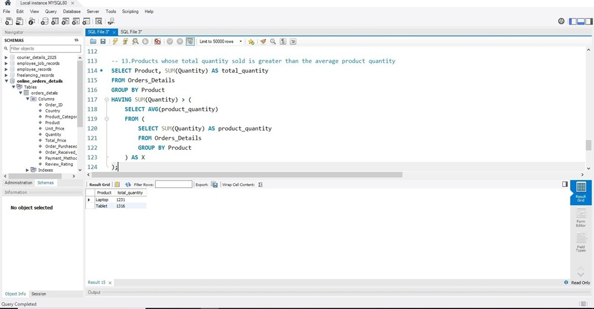
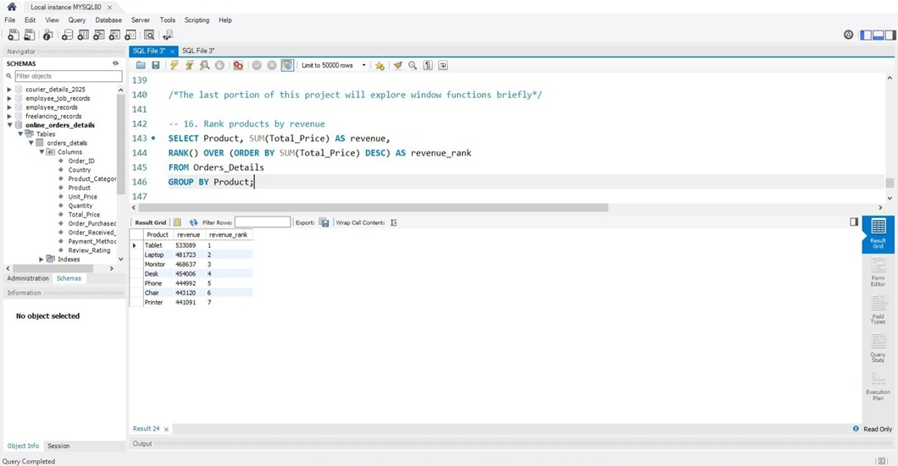

# 📦 Online Orders Details (MySQL Project)

## 📌 Project Overview  
This project demonstrates how to design and analyze an **Online Orders database** using **MySQL Workbench**.  
It covers database creation, table design, and advanced SQL queries including **Aggregations, GROUP BY, HAVING, Subqueries, CTEs, and Window functions**.  

The analysis generates insights such as:  
- Total Orders and Revenue  
- Orders and Revenue by Payment Method  
- Top Products by Sales Revenue  
- Orders above average order value  
- Products priced above average unit price  
- Top-selling product by revenue  
- Country-level sales and revenue analysis  
- Product ranking using **Window Functions**  

---

## 🎯 Objectives  
- Create a **data repository** inside MySQL Workbench  
- Import raw data from a `.csv` file  
- Apply SQL queries to analyze sales, revenue, and product trends  
- Explore **basic to advanced SQL concepts**:  
  - Aggregations (`COUNT`, `SUM`, `AVG`)  
  - Filtering (`WHERE`, `HAVING`)  
  - Grouping & Ordering (`GROUP BY`, `ORDER BY`)  
  - Subqueries  
  - Common Table Expressions (CTEs)  
  - Window Functions  

---

## ⚙️ Tools Used  
- **MySQL Workbench** → database creation & queries  
- **PowerPoint** → project documentation  

---

## 🛠️ Queries & Results  

### 1. Database & Table Creation  
**The first step in this project is to create a database.We can also use an already created
database and add a new table in it.**

CREATE DATABASE Online_Orders_Details;

USE Online_Orders_Details;

**The next step is to create a table inside our database. Before creating a table make
sure that the table has equal number of columns with same data type as in our .csv
data file downloaded from kaggle or any other database**

CREATE TABLE Orders_Details (
  Order_ID INT PRIMARY KEY,
  Country VARCHAR(20),
  Product_Category VARCHAR(50),
  Product VARCHAR(20),
  Unit_Price INT,
  Quantity INT,
  Total_Price INT,
  Order_Purchased_Date DATE,
  Order_Received_Date DATE,
  Payment_Method VARCHAR(50),
  Review_Rating INT
);

**Now that our table is created we can use "Table Data Import Wizard" function to
import data.Make sure data format is same as you have kept in your CREATE TABLE
syntax.**

### 2. Preview Data
**In the following step we will use SELECT query to preview our entire data table containing
all the entries in each column.**

SELECT * FROM Orders_Details;

### 3. Total Orders
**In order to calculate the total number of orders placed we wil use following query.**

SELECT COUNT(Order_ID) AS Total_Orders
FROM Orders_Details;

### 4. Total Revenue
**Calculate the total revenue generated from all orders.**

SELECT SUM(Total_Price) AS Total_Revenue
FROM Orders_Details;

### 5. Average Unit Price
**In this step we will calculate average unit price from our orders.**

SELECT AVG(Unit_Price) AS Avg_Unit_Price
FROM Orders_Details;

### 6. Top 5 Countries by Orders
**n this query we will find out top 5 countries with the most amount of orders
placed.This query will employ Group by,Order by and Limit function for the first time in
this project.**

SELECT Country, COUNT(Order_ID) AS Total_Orders
FROM Orders_Details
GROUP BY Country
ORDER BY Total_Orders DESC
LIMIT 5;

### 7. Total Revenue per Country
**In this step we will find out the total revenue made in each country**

SELECT Country, SUM(Total_Price) AS Total_Revenue
FROM Orders_Details
GROUP BY Country;

### 8. Average Review Rating by Product Category
**This query gives us average review rating for each product category.**

SELECT Product_Category, AVG(Review_Rating) AS Average_Review_Rating
FROM Orders_Details
GROUP BY Product_Category;

### 9. Orders & Revenue by Payment Method
**Analyze orders and revenue grouped by payment method.**

SELECT Payment_Method,
       COUNT(Order_ID) AS Total_Orders,
       SUM(Total_Price) AS Total_Revenue
FROM Orders_Details
GROUP BY Payment_Method;

### 10. Top 3 Products by Sales Revenue
**This query lists the top three products ranked by total sales revenue.**

SELECT Product, SUM(Total_Price) AS Total_Sales_Revenue
FROM Orders_Details
GROUP BY Product
ORDER BY Total_Sales_Revenue DESC
LIMIT 3;

### 11. Orders with Total Price > Average (Subquery)

SELECT *
FROM Orders_Details
WHERE Total_Price > (
  SELECT AVG(Total_Price) 
  FROM Orders_Details
);

### 12. Products with Unit Price > Average (Subquery)

SELECT Product, Unit_Price
FROM Orders_Details
WHERE Unit_Price > (
  SELECT AVG(Unit_Price)
  FROM Orders_Details
);

### 13. Top-Selling Product by Revenue

SELECT Product, SUM(Total_Price) AS Total_Revenue
FROM Orders_Details
GROUP BY Product
ORDER BY Total_Revenue DESC
LIMIT 1;

### 14. Countries with Revenue < Max Country Revenue (HAVING)

SELECT Country, SUM(Total_Price) AS Total_Revenue
FROM Orders_Details
GROUP BY Country
HAVING Total_Revenue < ( 
  SELECT MAX(Total_Revenue) 
  FROM (
    SELECT Country, SUM(Total_Price) AS Total_Revenue
    FROM Orders_Details
    GROUP BY Country
  ) AS X
);

### 15. Products with Total Quantity > Average (Subquery + HAVING)
**Find products with total quantity sold greater than the average product quantity.**

SELECT Product, SUM(Quantity) AS total_quantity
FROM Orders_Details
GROUP BY Product
HAVING SUM(Quantity) > (
  SELECT AVG(product_quantity) 
  FROM (
    SELECT SUM(Quantity) AS product_quantity
    FROM Orders_Details
    GROUP BY Product
  ) AS X
);

### 16. Orders with Total Price > Average (CTE)
**In this query we will usese a CTE to select orders with a total price above the average.**

WITH avg_orders AS (
  SELECT AVG(Total_Price) AS avg_price
  FROM Orders_Details
)
SELECT *
FROM Orders_Details, avg_orders
WHERE Total_Price > avg_price;

### 17. Total Revenue per Product (CTE)

WITH product_revenue AS (
  SELECT Product, SUM(Total_Price) AS total_revenue
  FROM Orders_Details
  GROUP BY Product
)
SELECT Product, total_revenue
FROM product_revenue;

### 18. Rank Products by Revenue (Window Function)
**In this query we will rank products based on revenue using a window function.**

WITH product_sales AS (
  SELECT Product, SUM(Total_Price) AS revenue    
  FROM Orders_Details
  GROUP BY Product
)
SELECT Product, revenue,
       RANK() OVER (ORDER BY revenue DESC) AS revenue_rank
FROM product_sales;

### 19. Order Value vs Overall Average (Window Function)
**This query compares each order value against the overall average using a window
function.**

SELECT Order_ID, Total_Price,
       AVG(Total_Price) OVER () AS avg_order_value
FROM Orders_Details;

(Screenshot can be added if available)

### 📂 Project Structure
📁 online-orders-mysql
 ┣ 📄 README.md
 ┣ 📄 Project_Description.pdf
 ┣ 📄 Online_Orders_Details.sql
 ┗ 📁 images
    ┣ image1.jpeg
    ┣ image2.jpeg
    ┣ ...
    ┗ image19.jpeg

### 🤝 Contribution

Contributions, suggestions, and feedback are welcome!
Feel free to fork the repository and submit pull requests.

### 📧 Contact

Author: Shahid Abbas
Email: shahidabbas2104514@gmail.com
